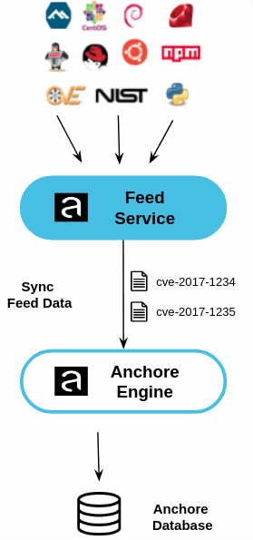

The Anchore Engine uses security vulnerability and package data froma number of sources:

- Feed **vulnerabilities** - security advisories from specific Linux Distribution vendors against Distribution specific packages.

    - Alpine Linux
    - CentOS
    - Debian
    - Oracle Linux
    - Red Hat Enterprise Linux
    - Ubuntu

- Feed **packages** - Software Package Repositories

    - RubyGems.org
    - NPMJS.org

- Feed **nvd** - NIST National Vulnerability Database (NVD)
- Third party feeds - additional data feeds are available for Anchore Enterprise Customers, see On Premise Feeds Overview for more information.

The Anchore Feed Service collects vulnerability and package data from the upstream sources and normalizes this data to be published as feeds that the Anchore Engine can subscribe to.

The Anchore engine polls the feed service at a user defined interval, by default every six hours, and will download feed data updated since the last sync.

Anchore hosts a public service on the Anchore Cloud which provides access, for free, to all public feeds.

An on-premises feed service is available for commercial customers allowing the Anchore Engine to synchronize with a locally deployed feed service, without any reliance on Anchore Cloud.

