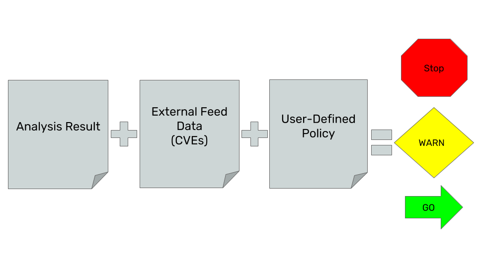

### What is Anchore Enterprise?

**_Anchore Enterprise_** is the commercial product built on the open-source Anchore Engine, with added components and features to enhance the use of Anchore at an organizational level, visualize data, and provide additional installation options to meet enterprise needs. It also adds services and support to both the open-source and proprietary components.

### What is Anchore Engine?

**_Anchore Engine_** is an open-source Docker container static analysis and policy-based compliance tool that automates the inspection, analysis, and evaluation of images against user-defined checks to allow high confidence in container deployments by ensuring workload content meets the required criteria. Anchore Engine ultimately provides a policy evaluation result for each image: pass/fail against policies defined by the user. Additionally, the way that policies are defined and evaluated allows the policy evaluation itself to double as an audit mechanism that allows point-in-time evaluations of specific image properties and content attributes.

### Anchore Enterprise vs. Anchore Engine

**_Anchore Enterprise_** provides features and capabilities in addition to those of the open-source **_Anchore Engine_**.

- On-Premises UI for visualization, policy editing, report generation, and user management
- RBAC support for the APIs
- Proprietary vulnerability data feeds to significantly enhance vulnerability detection in application packages and libraries (e.g. python, ruby gems, nodejs packages, java jars...)
- Fully On-Premises Vulnerability Feed Service providing vulnerability and package metadata
    - Full data provenance from vendor sources (RedHat, Debian, etc) into the analysis engine
    - Enables Air-Gapped deployments
- Commercial Support (8/5 or 24/7)

### How does it work?

Anchore takes a data-driven approach to analysis and policy enforcement. The system essentially has discrete phases for each image analyzed:

- **Fetch** the image content and extract it, but never execute it
- **Analyze** the image by running a set of Anchore analyzers over the image content to extract and classify as much metadata as possible
- **Save** the resulting analysis in the database for future use and audit
- **Evaluate** policies against the analysis result, including vulnerability matches on the artifacts discovered in the image
- **Update** to the latest external data used for policy evaluation and vulnerability matches (we call this external data sync a feed sync), and automatically update image analysis results against any new data found upstream.
- **Notify** users of changes to policy evaluations and vulnerability matches
Repeat 5 & 6 on intervals to ensure latest external data and updated image evaluations

The primary interface is a RESTful API that provides mechanisms to request analysis, policy evaluation, and monitoring of images in registries as well as query for image contents and analysis results. We also provide a CLI and its own container.

There are, generally speaking, two different ways to use Anchore, within its single API:

- Interactive Mode - Use the APIs to explicitly request an image analysis, get a policy evaluation and content reports, but the engine only performs operations when specifically requested by a user
- Watch Mode - Use the APIs to configure Anchore Engine to poll specific registries and repositories/tags to watch for new images added and automatically pull and evaluate them, emitting notifications when a given tag's vulnerability or policy evaluation state changes

With these two modes of operation, integration into CI/CD with Interative Mode or less intrusive watching of production image repositories with Watch Mode, Anchore can be easily integrated into most environments and processes.

### Next Steps

Now let's get familiar with [Images]() in Anchore.